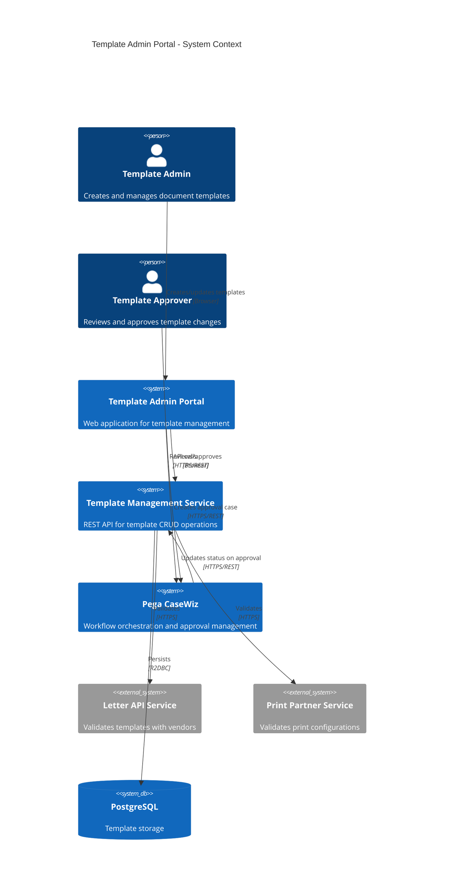
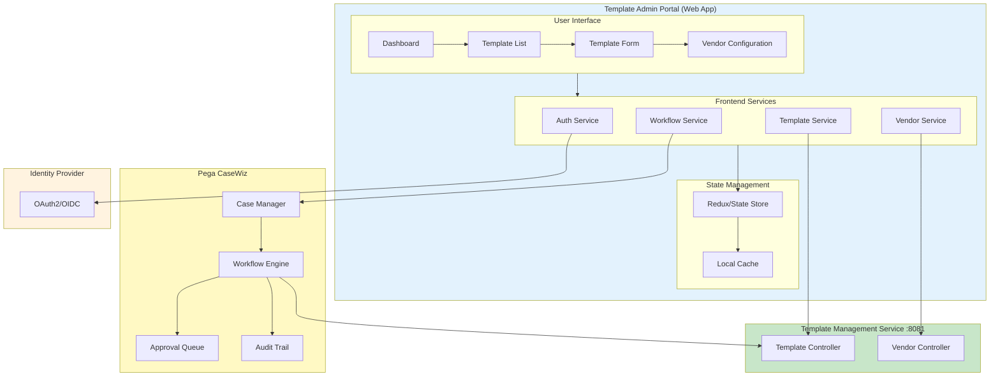
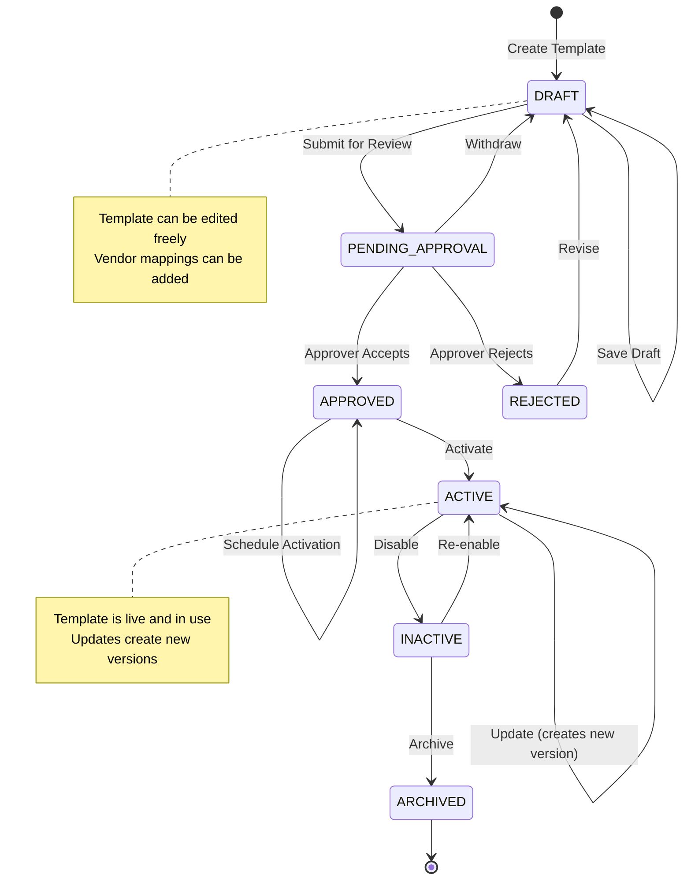
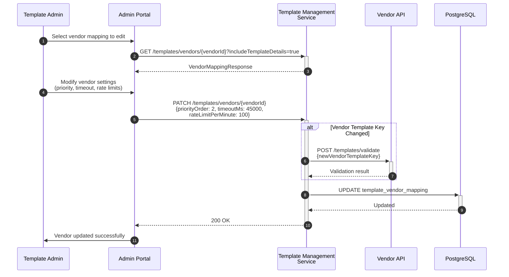
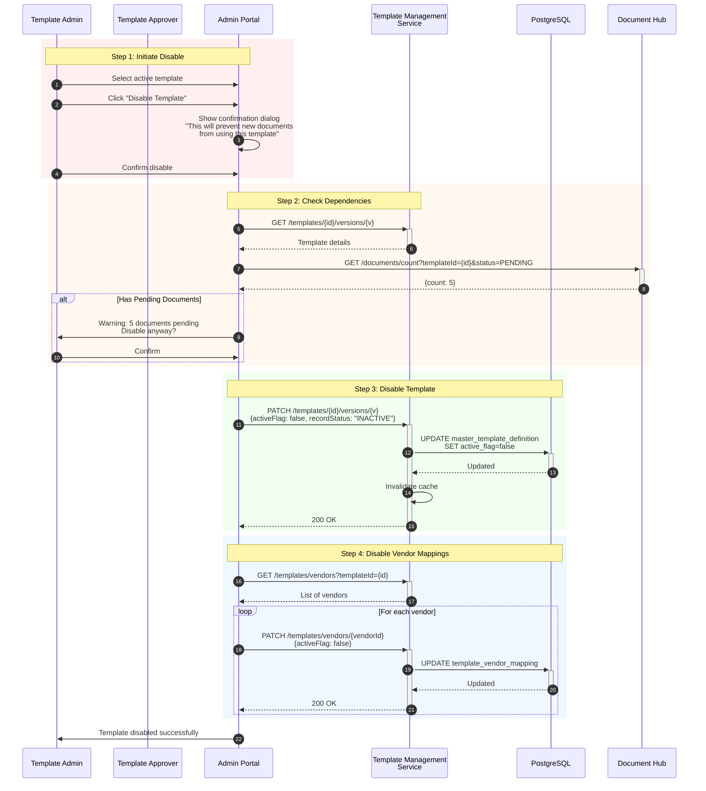
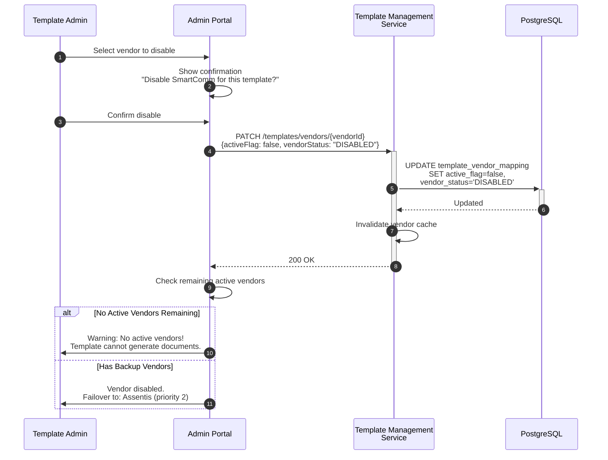
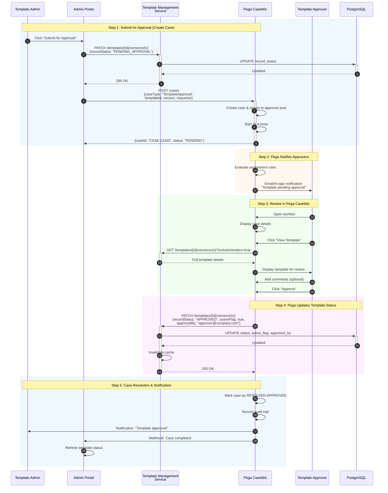
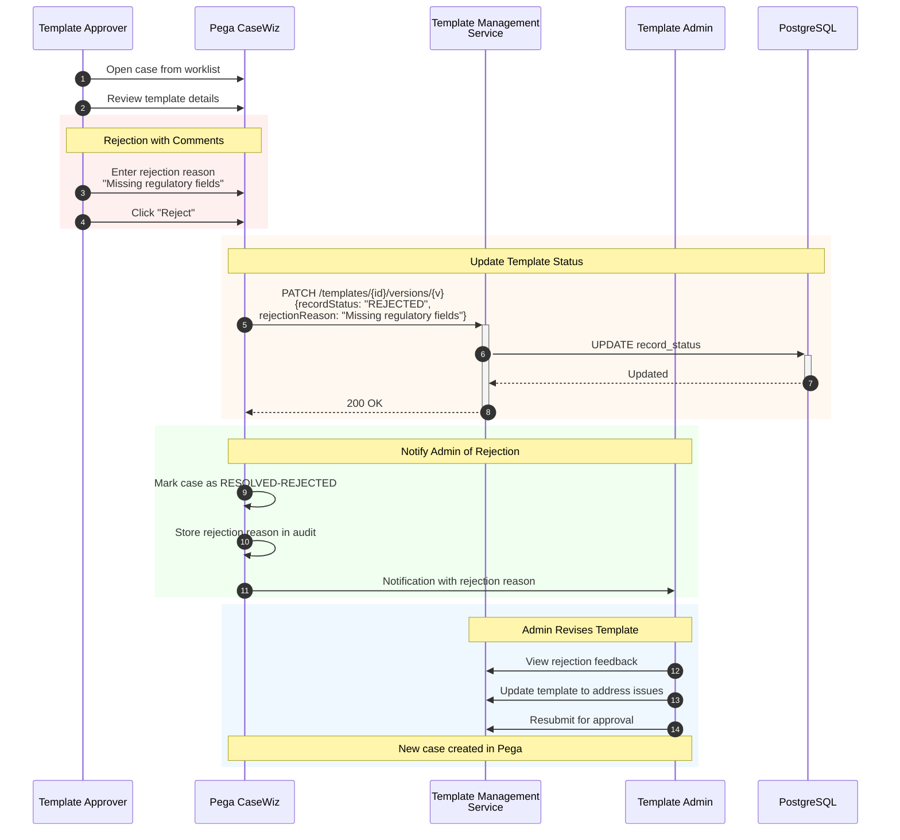

# Template Admin Portal - Integration Architecture

## Overview

This document illustrates how the Template Admin Portal interacts with the Template Management Service for creating, updating, and disabling templates and their vendor mappings.

**Approval Workflow**: The template approval process is managed by **Pega CaseWiz**, which provides case management, workflow orchestration, and audit trail capabilities.

---

## 1. System Context - Admin Portal Integration



---

## 2. Admin Portal Architecture



---

## 3. Template Lifecycle States



---

## 4. Create Template Flow


---

## 5. Update Template Flow


---

## 6. Update Vendor Mapping Flow



---

## 7. Disable Template Flow



---

## 8. Disable Vendor Mapping Flow



---

## 9. Approval Workflow with Pega CaseWiz



---

## 9a. Pega CaseWiz - Rejection Flow



---

## 9b. Pega CaseWiz Integration Details

### Case Data Model

| Field | Type | Description |
|-------|------|-------------|
| `caseId` | String | Pega-generated case ID (e.g., CASE-12345) |
| `caseType` | String | "TemplateApproval" |
| `templateId` | UUID | Reference to master_template_id |
| `templateVersion` | Integer | Template version being approved |
| `templateType` | String | Type of template (e.g., MONTHLY_STATEMENT) |
| `requestor` | String | Admin who submitted for approval |
| `assignedTo` | String | Current approver (from pool) |
| `status` | String | PENDING, IN_REVIEW, APPROVED, REJECTED |
| `slaDeadline` | DateTime | Auto-escalation deadline |
| `comments` | List | Approval/rejection comments |
| `auditTrail` | List | All actions with timestamps |

### Pega API Endpoints

```http
# Create approval case
POST /prweb/api/v1/cases
Content-Type: application/json
Authorization: Bearer {pega-token}

{
  "caseTypeID": "DOCMGMT-TemplateApproval",
  "content": {
    "templateId": "550e8400-e29b-41d4-a716-446655440000",
    "templateVersion": 1,
    "templateType": "MONTHLY_STATEMENT",
    "lineOfBusiness": "CREDIT_CARD",
    "displayName": "Monthly Credit Card Statement",
    "requestor": "admin@company.com",
    "urgency": "NORMAL"
  }
}

# Get case status
GET /prweb/api/v1/cases/{caseId}

# Webhook callback (Pega → Portal)
POST /api/v1/webhooks/pega/case-update
{
  "caseId": "CASE-12345",
  "status": "RESOLVED-APPROVED",
  "templateId": "550e8400-e29b-41d4-a716-446655440000",
  "approvedBy": "approver@company.com",
  "approvedAt": "2024-01-15T14:30:00Z"
}
```

### Workflow Configuration in Pega

```
┌─────────────────────────────────────────────────────────────────┐
│                  PEGA CASEWIZ WORKFLOW                          │
├─────────────────────────────────────────────────────────────────┤
│                                                                 │
│   ┌─────────┐     ┌──────────┐     ┌───────────┐               │
│   │  START  │────▶│ PENDING  │────▶│ IN_REVIEW │               │
│   └─────────┘     └──────────┘     └───────────┘               │
│                        │                 │                      │
│                        │            ┌────┴────┐                 │
│                        │            ▼         ▼                 │
│                   [SLA Breach]  ┌────────┐ ┌──────────┐         │
│                        │        │APPROVED│ │ REJECTED │         │
│                        ▼        └────────┘ └──────────┘         │
│                   ┌─────────┐       │           │               │
│                   │ESCALATE │       │           │               │
│                   └─────────┘       ▼           ▼               │
│                        │        ┌───────────────────┐           │
│                        └───────▶│   RESOLVED        │           │
│                                 └───────────────────┘           │
│                                                                 │
│  Assignment Rules:                                              │
│  • Credit Card templates → CC Approval Team                     │
│  • Regulatory templates → Compliance Team                       │
│  • High-value templates → Senior Approvers                      │
│                                                                 │
│  SLA Configuration:                                             │
│  • Normal: 48 hours                                             │
│  • Urgent: 4 hours                                              │
│  • Escalation: Manager notification                             │
└─────────────────────────────────────────────────────────────────┘
```

---

## 10. Complete Admin Operations Matrix

```mermaid
flowchart TB
    subgraph Templates["Template Operations"]
        direction TB
        T1[Create Template]
        T2[Update Template]
        T3[Disable Template]
        T4[Enable Template]
        T5[Archive Template]
        T6[Clone Template]
    end

    subgraph Vendors["Vendor Operations"]
        direction TB
        V1[Add Vendor Mapping]
        V2[Update Vendor Config]
        V3[Disable Vendor]
        V4[Enable Vendor]
        V5[Set Primary Vendor]
        V6[Update Priority Order]
    end

    subgraph Approval["Approval Operations (via Pega CaseWiz)"]
        direction TB
        A1[Submit for Approval]
        A2[Approve Template]
        A3[Reject Template]
        A4[Withdraw Submission]
    end

    subgraph API["Template Management Service API"]
        POST_T[POST /templates]
        PATCH_T[PATCH /templates/{id}/versions/{v}]
        DELETE_T[DELETE /templates/{id}/versions/{v}]
        POST_V[POST /templates/vendors]
        PATCH_V[PATCH /templates/vendors/{id}]
        DELETE_V[DELETE /templates/vendors/{id}]
    end

    subgraph Pega["Pega CaseWiz API"]
        POST_CASE[POST /prweb/api/v1/cases]
        GET_CASE[GET /prweb/api/v1/cases/{id}]
        PATCH_CASE[PATCH /prweb/api/v1/cases/{id}]
    end

    T1 --> POST_T
    T2 --> PATCH_T
    T3 --> PATCH_T
    T4 --> PATCH_T
    T5 --> DELETE_T
    T6 --> POST_T

    V1 --> POST_V
    V2 --> PATCH_V
    V3 --> PATCH_V
    V4 --> PATCH_V
    V5 --> PATCH_V
    V6 --> PATCH_V

    A1 --> PATCH_T
    A1 --> POST_CASE
    A2 --> PATCH_CASE
    A2 -.-> PATCH_T
    A3 --> PATCH_CASE
    A3 -.-> PATCH_T
    A4 --> PATCH_CASE
    A4 -.-> PATCH_T

    style Templates fill:#bbdefb
    style Vendors fill:#c8e6c9
    style Approval fill:#fff9c4
    style API fill:#f8bbd9
    style Pega fill:#ffe0b2
```

---

## 11. API Request/Response Examples

### Create Template

```http
POST /api/v1/templates
Content-Type: application/json
X-Correlation-Id: admin-create-001
X-User-Id: admin@company.com

{
  "templateType": "MONTHLY_STATEMENT",
  "lineOfBusiness": "CREDIT_CARD",
  "displayName": "Monthly Credit Card Statement",
  "templateDescription": "Monthly statement for credit card accounts",
  "templateCategory": "STATEMENT",
  "languageCode": "en",
  "owningDept": "CARD_SERVICES",
  "communicationType": "LETTER",
  "workflow": "4_EYES",
  "singleDocumentFlag": false,
  "startDate": 1704067200000,
  "templateConfig": {
    "pageSize": "LETTER",
    "orientation": "PORTRAIT"
  }
}
```

**Response:**
```json
{
  "template": {
    "masterTemplateId": "550e8400-e29b-41d4-a716-446655440000",
    "templateVersion": 1,
    "templateType": "MONTHLY_STATEMENT",
    "lineOfBusiness": "CREDIT_CARD",
    "displayName": "Monthly Credit Card Statement",
    "activeFlag": true,
    "recordStatus": "DRAFT",
    "createdBy": "admin@company.com",
    "createdTimestamp": "2024-01-15T10:30:00"
  }
}
```

### Add Vendor Mapping

```http
POST /api/v1/templates/vendors
Content-Type: application/json
X-Correlation-Id: admin-vendor-001
X-User-Id: admin@company.com

{
  "masterTemplateId": "550e8400-e29b-41d4-a716-446655440000",
  "templateVersion": 1,
  "vendor": "SmartComm",
  "vendorType": "GENERATION",
  "vendorTemplateKey": "CC_STMT_V1",
  "vendorTemplateName": "Credit Card Statement Template",
  "primaryFlag": true,
  "priorityOrder": 1,
  "timeoutMs": 30000,
  "maxRetryAttempts": 3
}
```

### Disable Template

```http
PATCH /api/v1/templates/550e8400-e29b-41d4-a716-446655440000/versions/1
Content-Type: application/json
X-Correlation-Id: admin-disable-001
X-User-Id: admin@company.com

{
  "activeFlag": false,
  "recordStatus": "INACTIVE"
}
```

---

## 12. Admin Portal UI Wireframes

### Template List View

```
┌─────────────────────────────────────────────────────────────────────────┐
│  TEMPLATE ADMIN PORTAL                            [Admin User ▼] [⚙️]   │
├─────────────────────────────────────────────────────────────────────────┤
│  Templates  │  Vendors  │  Approvals (3)  │  Reports                    │
├─────────────────────────────────────────────────────────────────────────┤
│                                                                         │
│  [+ Create Template]    [Filter ▼]  [Search... 🔍]                      │
│                                                                         │
│  ┌─────────────────────────────────────────────────────────────────┐   │
│  │ Type              │ LOB         │ Status  │ Version │ Actions   │   │
│  ├───────────────────┼─────────────┼─────────┼─────────┼───────────┤   │
│  │ MONTHLY_STATEMENT │ CREDIT_CARD │ 🟢 ACTIVE │ v3    │ [Edit][▼] │   │
│  │ WELCOME_LETTER    │ CREDIT_CARD │ 🟢 ACTIVE │ v1    │ [Edit][▼] │   │
│  │ RATE_CHANGE       │ CREDIT_CARD │ 🟡 DRAFT  │ v2    │ [Edit][▼] │   │
│  │ CLOSURE_NOTICE    │ SAVINGS     │ 🔴 INACTIVE│ v1   │ [Edit][▼] │   │
│  └─────────────────────────────────────────────────────────────────┘   │
│                                                                         │
│  Showing 1-4 of 4 templates                        [< 1 2 3 ... 10 >]   │
└─────────────────────────────────────────────────────────────────────────┘
```

### Template Edit View

```
┌─────────────────────────────────────────────────────────────────────────┐
│  ← Back to Templates    MONTHLY_STATEMENT (v3)           [Save Draft]   │
├─────────────────────────────────────────────────────────────────────────┤
│                                                                         │
│  ┌─ Basic Information ─────────────────────────────────────────────┐   │
│  │  Template Type:    MONTHLY_STATEMENT                             │   │
│  │  Display Name:     [Monthly Credit Card Statement          ]     │   │
│  │  Line of Business: [CREDIT_CARD ▼]                               │   │
│  │  Category:         [STATEMENT ▼]                                 │   │
│  │  Status:           🟢 ACTIVE                                     │   │
│  └──────────────────────────────────────────────────────────────────┘   │
│                                                                         │
│  ┌─ Vendor Mappings ───────────────────────────────────────────────┐   │
│  │  [+ Add Vendor]                                                  │   │
│  │                                                                  │   │
│  │  ┌─────────────────────────────────────────────────────────┐    │   │
│  │  │ 🟢 SmartComm (GENERATION)  Priority: 1  ⭐ Primary       │    │   │
│  │  │    Template Key: CC_STMT_V1                    [Edit][❌]│    │   │
│  │  └─────────────────────────────────────────────────────────┘    │   │
│  │  ┌─────────────────────────────────────────────────────────┐    │   │
│  │  │ 🟢 LPS (PRINT)            Priority: 1                   │    │   │
│  │  │    Account: LPS-PROD-001                       [Edit][❌]│    │   │
│  │  └─────────────────────────────────────────────────────────┘    │   │
│  └──────────────────────────────────────────────────────────────────┘   │
│                                                                         │
│  [Disable Template]  [Create New Version]  [Submit for Approval]        │
└─────────────────────────────────────────────────────────────────────────┘
```

---

## View These Diagrams

1. **GitHub/GitLab**: Mermaid diagrams render automatically
2. **VS Code**: Install "Markdown Preview Mermaid Support" extension
3. **Online**: Use [Mermaid Live Editor](https://mermaid.live)
