# Template Admin Portal - Integration Architecture

## Overview

This document illustrates how the Template Admin Portal interacts with the Template Management Service for creating, updating, and disabling templates and their vendor mappings.

**Approval Workflow**: The template approval process is managed by **Pega CaseWiz**, which provides case management, workflow orchestration, and audit trail capabilities.

**Approval Impact**:
- **Template**: Approval sets `record_status=Approved` and `activeFlag=true`
- **Vendor Mappings**: Approval sets `vendor_mapping_status=Approved` and `activeFlag=true`

**Status Values**: `Draft`, `Pending`, `Approved`, `Archived`

---

## 0. Glossary

| Term | Definition |
|------|------------|
| **Resource** | Specification that provides metadata about a resource, points to or holds a data structure, that allows us to manage them efficiently |
| **Document** | Refers to a file that will be stored on DCMS; there is no significance on the fact that it happens to be a "Template" |
| **Resource Approver** | Refers to a CTB employee or contractor that has the ability to approve a new template. (We can have a different type of role for each template if needed) |

---

## 1. System Context - Admin Portal Integration


---

## 2. Admin Portal Architecture


---

## 2a. Data Ownership

```mermaid
flowchart LR
    subgraph CaseWiz["CaseWiz DB"]
        CaseInfo["CASE INFO<br/>─────────────<br/>• Case ID<br/>• Case Status<br/>• Approver Info<br/>• Approval Timestamp<br/>─────────────<br/>We do not need to keep<br/>the whole approval info.<br/>Query CaseWiz to discover<br/>who approved it and when."]
    end

    subgraph DocHubDB["Document Hub DB"]
        Resources["RESOURCES Table<br/>─────────────<br/>• Resource ID<br/>• Category<br/>• Line of Business<br/>• Communication Type<br/>• DCMS Folder Reference<br/>• Metadata JSON<br/>─────────────<br/>Contains DCMS 'folder'<br/>where templates are stored"]
    end

    subgraph DCMSStorage["DCMS"]
        Files["FILE STORAGE<br/>─────────────<br/>Organized by:<br/>category/<br/>  line_of_business/<br/>    communication_type/<br/>      doc/<br/>─────────────<br/>Example:<br/>STATEMENTS/<br/>  CREDIT_CARD/<br/>    MONTHLY_STATEMENT/<br/>      PROD-2025.01.01/<br/>        EP001-approved.pdf"]
    end

    subgraph TMS["Template Management Service"]
        Templates["TEMPLATE METADATA<br/>─────────────<br/>• Template Definition<br/>• Vendor Mappings<br/>• Template Variables<br/>• Eligibility Criteria<br/>─────────────<br/>Note: Template file<br/>reference points to DCMS"]
    end

    CaseWiz -.->|"Case Status"| TMS
    TMS -->|"Resource Metadata"| DocHubDB
    DocHubDB -->|"File Reference"| DCMSStorage

    style CaseWiz fill:#ffecb3
    style DocHubDB fill:#c8e6c9
    style DCMSStorage fill:#bbdefb
    style TMS fill:#f8bbd9
```



### Data Ownership Summary

| System | Data Owned | Purpose |
|--------|-----------|---------|
| **CaseWiz** | Case ID, Status, Approver, Timestamps | Authentic record of approval workflow; query to get approval details |
| **Document Hub DB** | Resource metadata, DCMS folder reference | JSON record in RESOURCES table with folder location |
| **DCMS** | Actual template files | Physical file storage organized by `category/lob/comm_type/doc` |
| **Template Management** | Template definitions, vendor mappings | Business configuration and routing rules |

---

## 2b. Template Wizard - 6 Step Configuration Process

The Template Wizard provides a guided 6-step process for creating document templates without requiring technical knowledge.


### Step 1: Basic Information
| Field | Description | Options |
|-------|-------------|---------|
| Template Name | Display name for the template | Free text |
| Description | Template purpose and usage | Free text |
| Document Category | Type of document | Statement, Legal, Tax, Regulatory, Notice |
| Line of Business | Business area | CREDIT_CARD, SAVINGS, MORTGAGE, etc. |

### Step 2: Document Ownership
| Type | Description | Use Case |
|------|-------------|----------|
| Account-specific | Document belongs to a specific account | Statements, notices |
| Customer-wide | Document accessible to all accounts for a customer | Disclosures |
| Shared/Public | Document available to multiple customers | Marketing materials |
| Conditional | Access based on eligibility rules | Premium-tier documents |

### Step 3: Extractable Fields
- Pre-populated fields based on document category
- Add custom fields as needed
- Automatic field type detection (DATE, STRING, NUMBER, etc.)
- Required/optional field configuration

### Step 4: Source APIs
Three ways to configure source APIs for eligibility checks:

| Option | Description | When to Use |
|--------|-------------|-------------|
| **A: Existing API** | Select from pre-defined APIs (Credit Info, Account Info, Arrangements) | Common use cases |
| **B: Upload API Spec** | Upload OpenAPI 3.0/Swagger 2.0 JSON specification | New integrations |
| **C: Custom API** | Manually register new API with endpoint and fields | One-off integrations |

### Step 5: Access Rules
- Visual rule builder with dropdown selections
- Plain language description option
- Automatic field population from selected API
- Example: `membershipTier IN ["PLATINUM", "GOLD"]`

### Step 6: Review & Generate
- Summary of all configurations
- Generated JSON configuration
- Downloadable SQL INSERT statement for `master_template_definition`

---

## 2c. Template Onboarding Process Flow

The end-to-end onboarding process from business request to production deployment.


### Onboarding Timeline

| Phase | Activities | Duration | Owner |
|-------|------------|----------|-------|
| **Phase 1: Request** | Submit request, define requirements, provide sample | 1-2 days | Business |
| **Phase 2: Configuration** | Use wizard, IT review, insert to DEV | 1-2 days | Business + IT |
| **Phase 3: Setup & UAT** | Vendor mapping, integration tests, UAT | 2-3 days | IT + Business |
| **Phase 4: Deployment** | Migration script, PROD deploy, smoke test | 1 day | IT |

**Total: ~6 days typical**

### RACI Matrix

| Activity | Business | IT | Management |
|----------|----------|-----|------------|
| Submit Request | R/A | I | I |
| Define Requirements | R/A | C | I |
| Use Template Wizard | R | C | I |
| Review Configuration | C | R/A | I |
| Deploy to DEV | I | R/A | I |
| Run Tests | I | R/A | I |
| UAT Testing | R/A | C | I |
| Deploy to PROD | I | R/A | A |
| Go-Live Confirmation | R | I | A |

*R=Responsible, A=Accountable, C=Consulted, I=Informed*

---

## 3. Template Lifecycle States


---

## 4. Create Template Flow


---

## 5. Update Template Flow


---

## 6. Update Vendor Mapping Flow


---

## 7. Disable Template Flow


---

## 8. Disable Vendor Mapping Flow


---

## 9. Approval Workflow with Pega CaseWiz

This sequence follows the architecture: **UI → BFF → CaseWiz → PEGA → Template Management → Document Hub → DCMS**


---

## 9a. Pega CaseWiz - Rejection Flow


---

## 9b. Pega CaseWiz Integration Details

### Case Data Model (Stored in CaseWiz/ChaseNet DB)

| Field | Type | Description |
|-------|------|-------------|
| `caseId` | String | Pega-generated case ID (e.g., CASE-12345) |
| `caseType` | String | "ResourceApproval" |
| `documentId` | String | Reference to resource/document being approved |
| `resourceType` | String | Type of resource (e.g., TEMPLATE, STATEMENT) |
| `requestor` | String | Resource creator who submitted for approval |
| `assignedTo` | String | Current approver (from pool based on rules) |
| `status` | String | Pending, In Review, Approved, Rejected, Resolved |
| `slaDeadline` | DateTime | Auto-escalation deadline |
| `comments` | List | Approval/rejection comments |

**Note**: CaseWiz contains the authentic record of approval. We do not need to keep the whole approval information in Document Hub - query CaseWiz to discover who approved it and when.

### Resource Data Model (Stored in Document Hub DB)

| Field | Type | Description |
|-------|------|-------------|
| `id` | UUID | Resource identifier |
| `category` | String | e.g., STATEMENTS, DISCLOSURES |
| `resourceType` | String | e.g., MONTHLY_STATEMENT |
| `lineOfBusiness` | String | e.g., CREDIT_CARD |
| `description` | String | Resource description |
| `docType` | String | e.g., PDF |
| `languageCode` | String | e.g., EN_US |
| `createdTimestamp` | DateTime | Creation time |
| `department` | String | Owning department |
| `effectiveStart` | Date | Effective start date |
| `effectiveEnd` | Date | Effective end date |
| `status` | String | Draft, Pending, Approved, Archived |
| `caseId` | String | Reference to CaseWiz case |
| `dcmsFolderRef` | String | DCMS folder path reference |

### DCMS File Storage Structure

```
category/
  line_of_business/
    communication_type/
      doc/
        PROD-{date}/
          {resource_id}-approved.{ext}

Example:
STATEMENTS/
  CREDIT_CARD/
    MONTHLY_STATEMENT/
      PROD-2025.01.01/
        EP001-approved.pdf
        EP001-approved-v2.pdf
```

### Approval Impact on Records

| Decision | Document Hub Effect | DCMS Effect |
|----------|---------------------|-------------|
| **Approve** | `status=Approved`, `activeFlag=true`, `dcmsFolderRef` populated | File stored in approved folder |
| **Reject** | `status=Draft`, `activeFlag=false` | No file stored |
| **Archive** | `status=Archived`, `activeFlag=false` | File remains but marked archived |

### Pega API Endpoints

```http
# Create approval case
POST /prweb/api/v1/cases
Content-Type: application/json
Authorization: Bearer {pega-token}

{
  "caseTypeID": "DOCMGMT-TemplateApproval",
  "content": {
    "templateId": "550e8400-e29b-41d4-a716-446655440000",
    "templateVersion": 1,
    "templateType": "MONTHLY_STATEMENT",
    "lineOfBusiness": "CREDIT_CARD",
    "displayName": "Monthly Credit Card Statement",
    "requestor": "admin@company.com",
    "urgency": "NORMAL"
  }
}

# Get case status
GET /prweb/api/v1/cases/{caseId}

# Webhook callback (Pega → Portal)
POST /api/v1/webhooks/pega/case-update
{
  "caseId": "CASE-12345",
  "status": "Resolved-Approved",
  "templateId": "550e8400-e29b-41d4-a716-446655440000",
  "templateVersion": 1,
  "decision": "Approved",
  "approvedBy": "approver@company.com",
  "approvedAt": "2024-01-15T14:30:00Z",
  "templateUpdate": {
    "activeFlag": true,
    "recordStatus": "Approved"
  },
  "vendorMappingsUpdated": [
    {
      "vendorId": "660e8400-e29b-41d4-a716-446655440001",
      "vendor": "SmartComm",
      "vendorMappingStatus": "Approved",
      "activeFlag": true
    },
    {
      "vendorId": "660e8400-e29b-41d4-a716-446655440002",
      "vendor": "LPS",
      "vendorMappingStatus": "Approved",
      "activeFlag": true
    }
  ]
}
```

### Workflow Configuration in Pega

```
┌─────────────────────────────────────────────────────────────────┐
│                  PEGA CASEWIZ WORKFLOW                          │
├─────────────────────────────────────────────────────────────────┤
│                                                                 │
│   ┌─────────┐     ┌──────────┐     ┌───────────┐               │
│   │  START  │────▶│ Pending  │────▶│ In Review │               │
│   └─────────┘     └──────────┘     └───────────┘               │
│                        │                 │                      │
│                        │            ┌────┴────┐                 │
│                        │            ▼         ▼                 │
│                   [SLA Breach]  ┌────────┐ ┌──────────┐         │
│                        │        │Approved│ │ Rejected │         │
│                        ▼        └────────┘ └──────────┘         │
│                   ┌─────────┐       │           │               │
│                   │Escalate │       │     (→ Draft)             │
│                   └─────────┘       ▼           ▼               │
│                        │        ┌───────────────────┐           │
│                        └───────▶│   Resolved        │           │
│                                 └───────────────────┘           │
│                                                                 │
│  Status Flow:                                                   │
│  • Approved → Template: record_status=Approved, activeFlag=true │
│  • Rejected → Template: record_status=Draft, activeFlag=false   │
│                                                                 │
│  Assignment Rules:                                              │
│  • Credit Card templates → CC Approval Team                     │
│  • Regulatory templates → Compliance Team                       │
│  • High-value templates → Senior Approvers                      │
│                                                                 │
│  SLA Configuration:                                             │
│  • Normal: 48 hours                                             │
│  • Urgent: 4 hours                                              │
│  • Escalation: Manager notification                             │
└─────────────────────────────────────────────────────────────────┘
```

---

## 10. Complete Admin Operations Matrix

```mermaid
flowchart TB
    subgraph Templates["Template Operations"]
        direction TB
        T1[Create Template]
        T2[Update Template]
        T3[Disable Template]
        T4[Enable Template]
        T5[Archive Template]
        T6[Clone Template]
    end

    subgraph Vendors["Vendor Operations"]
        direction TB
        V1[Add Vendor Mapping]
        V2[Update Vendor Config]
        V3[Disable Vendor]
        V4[Enable Vendor]
        V5[Set Primary Vendor]
        V6[Update Priority Order]
    end

    subgraph Approval["Approval Operations (via Pega CaseWiz)"]
        direction TB
        A1[Submit for Approval]
        A2[Approve Template]
        A3[Reject Template]
        A4[Withdraw Submission]
    end

    subgraph API["Template Management Service API"]
        POST_T[POST /templates]
        PATCH_T[PATCH /templates/{id}/versions/{v}]
        DELETE_T[DELETE /templates/{id}/versions/{v}]
        POST_V[POST /templates/vendors]
        PATCH_V[PATCH /templates/vendors/{id}]
        DELETE_V[DELETE /templates/vendors/{id}]
    end

    subgraph Pega["Pega CaseWiz API"]
        POST_CASE[POST /prweb/api/v1/cases]
        GET_CASE[GET /prweb/api/v1/cases/{id}]
        PATCH_CASE[PATCH /prweb/api/v1/cases/{id}]
    end

    T1 --> POST_T
    T2 --> PATCH_T
    T3 --> PATCH_T
    T4 --> PATCH_T
    T5 --> DELETE_T
    T6 --> POST_T

    V1 --> POST_V
    V2 --> PATCH_V
    V3 --> PATCH_V
    V4 --> PATCH_V
    V5 --> PATCH_V
    V6 --> PATCH_V

    A1 --> PATCH_T
    A1 --> POST_CASE
    A2 --> PATCH_CASE
    A2 -.-> PATCH_T
    A3 --> PATCH_CASE
    A3 -.-> PATCH_T
    A4 --> PATCH_CASE
    A4 -.-> PATCH_T

    style Templates fill:#bbdefb
    style Vendors fill:#c8e6c9
    style Approval fill:#fff9c4
    style API fill:#f8bbd9
    style Pega fill:#ffe0b2
```

---

## 11. API Request/Response Examples

### Create Template

```http
POST /api/v1/templates
Content-Type: application/json
X-Correlation-Id: admin-create-001
X-User-Id: admin@company.com

{
  "templateType": "MONTHLY_STATEMENT",
  "lineOfBusiness": "CREDIT_CARD",
  "displayName": "Monthly Credit Card Statement",
  "templateDescription": "Monthly statement for credit card accounts",
  "templateCategory": "STATEMENT",
  "languageCode": "en",
  "owningDept": "CARD_SERVICES",
  "communicationType": "LETTER",
  "workflow": "4_EYES",
  "singleDocumentFlag": false,
  "startDate": 1704067200000,
  "templateConfig": {
    "pageSize": "LETTER",
    "orientation": "PORTRAIT"
  }
}
```

**Response:**
```json
{
  "template": {
    "masterTemplateId": "550e8400-e29b-41d4-a716-446655440000",
    "templateVersion": 1,
    "templateType": "MONTHLY_STATEMENT",
    "lineOfBusiness": "CREDIT_CARD",
    "displayName": "Monthly Credit Card Statement",
    "activeFlag": false,
    "recordStatus": "Draft",
    "createdBy": "admin@company.com",
    "createdTimestamp": "2024-01-15T10:30:00"
  }
}
```

### Add Vendor Mapping

```http
POST /api/v1/templates/vendors
Content-Type: application/json
X-Correlation-Id: admin-vendor-001
X-User-Id: admin@company.com

{
  "masterTemplateId": "550e8400-e29b-41d4-a716-446655440000",
  "templateVersion": 1,
  "vendor": "SmartComm",
  "vendorType": "GENERATION",
  "vendorTemplateKey": "CC_STMT_V1",
  "vendorTemplateName": "Credit Card Statement Template",
  "primaryFlag": true,
  "priorityOrder": 1,
  "timeoutMs": 30000,
  "maxRetryAttempts": 3
}
```

### Archive Template

```http
PATCH /api/v1/templates/550e8400-e29b-41d4-a716-446655440000/versions/1
Content-Type: application/json
X-Correlation-Id: admin-archive-001
X-User-Id: admin@company.com

{
  "activeFlag": false,
  "recordStatus": "Archived"
}
```

---

## 12. Admin Portal UI Wireframes

### Template List View

```
┌─────────────────────────────────────────────────────────────────────────┐
│  TEMPLATE ADMIN PORTAL                            [Admin User ▼] [⚙️]   │
├─────────────────────────────────────────────────────────────────────────┤
│  Templates  │  Vendors  │  Approvals (3)  │  Reports                    │
├─────────────────────────────────────────────────────────────────────────┤
│                                                                         │
│  [+ Create Template]    [Filter ▼]  [Search... 🔍]                      │
│                                                                         │
│  ┌─────────────────────────────────────────────────────────────────┐   │
│  │ Type              │ LOB         │ Status    │ Version │ Actions   │   │
│  ├───────────────────┼─────────────┼───────────┼─────────┼───────────┤   │
│  │ MONTHLY_STATEMENT │ CREDIT_CARD │ 🟢 Approved│ v3     │ [Edit][▼] │   │
│  │ WELCOME_LETTER    │ CREDIT_CARD │ 🟢 Approved│ v1     │ [Edit][▼] │   │
│  │ RATE_CHANGE       │ CREDIT_CARD │ 🟡 Draft   │ v2     │ [Edit][▼] │   │
│  │ CLOSURE_NOTICE    │ SAVINGS     │ 🔵 Pending │ v1     │ [Edit][▼] │   │
│  └─────────────────────────────────────────────────────────────────┘   │
│                                                                         │
│  Showing 1-4 of 4 templates                        [< 1 2 3 ... 10 >]   │
└─────────────────────────────────────────────────────────────────────────┘
```

### Template Edit View

```
┌─────────────────────────────────────────────────────────────────────────┐
│  ← Back to Templates    MONTHLY_STATEMENT (v3)           [Save Draft]   │
├─────────────────────────────────────────────────────────────────────────┤
│                                                                         │
│  ┌─ Basic Information ─────────────────────────────────────────────┐   │
│  │  Template Type:    MONTHLY_STATEMENT                             │   │
│  │  Display Name:     [Monthly Credit Card Statement          ]     │   │
│  │  Line of Business: [CREDIT_CARD ▼]                               │   │
│  │  Category:         [STATEMENT ▼]                                 │   │
│  │  Status:           🟢 Approved                                    │   │
│  └──────────────────────────────────────────────────────────────────┘   │
│                                                                         │
│  ┌─ Vendor Mappings ───────────────────────────────────────────────┐   │
│  │  [+ Add Vendor]                                                  │   │
│  │                                                                  │   │
│  │  ┌─────────────────────────────────────────────────────────┐    │   │
│  │  │ 🟢 SmartComm (GENERATION)  Priority: 1  ⭐ Primary       │    │   │
│  │  │    Template Key: CC_STMT_V1                    [Edit][❌]│    │   │
│  │  └─────────────────────────────────────────────────────────┘    │   │
│  │  ┌─────────────────────────────────────────────────────────┐    │   │
│  │  │ 🟢 LPS (PRINT)            Priority: 1                   │    │   │
│  │  │    Account: LPS-PROD-001                       [Edit][❌]│    │   │
│  │  └─────────────────────────────────────────────────────────┘    │   │
│  └──────────────────────────────────────────────────────────────────┘   │
│                                                                         │
│  [Disable Template]  [Create New Version]  [Submit for Approval]        │
└─────────────────────────────────────────────────────────────────────────┘
```

---

## View These Diagrams

1. **GitHub/GitLab**: Mermaid diagrams render automatically
2. **VS Code**: Install "Markdown Preview Mermaid Support" extension
3. **Online**: Use [Mermaid Live Editor](https://mermaid.live)
