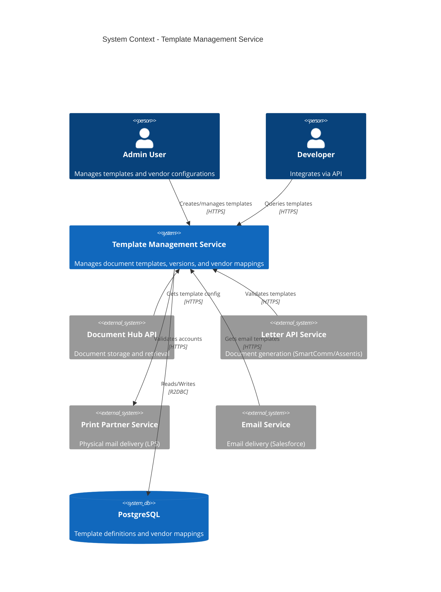
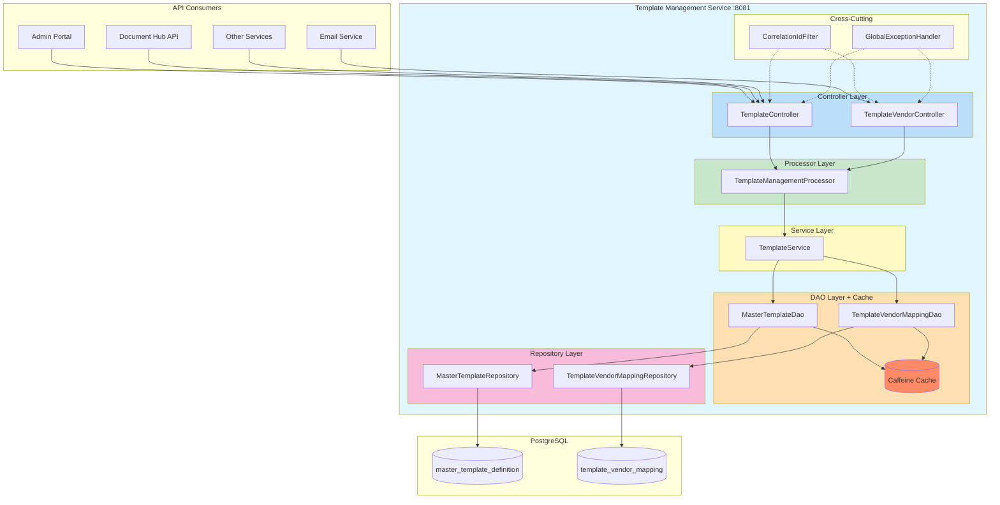
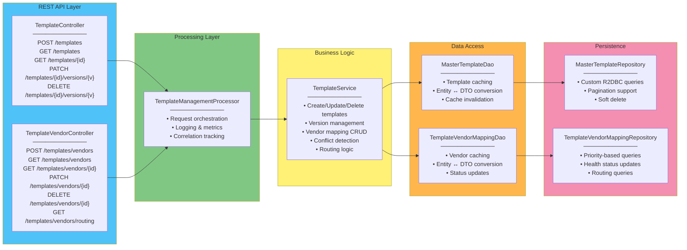
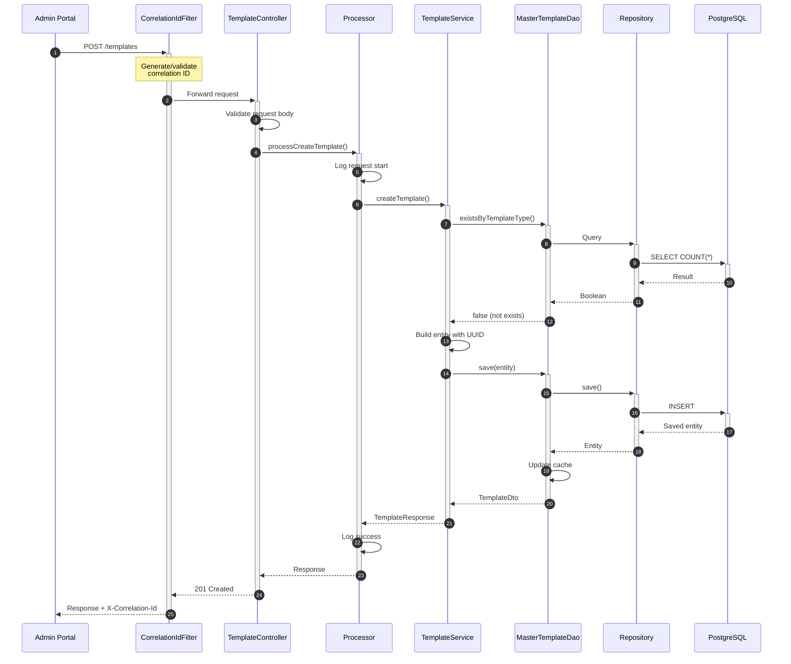
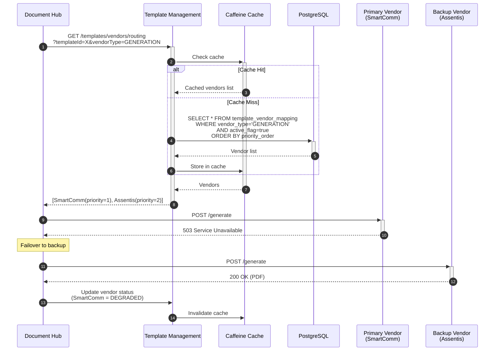
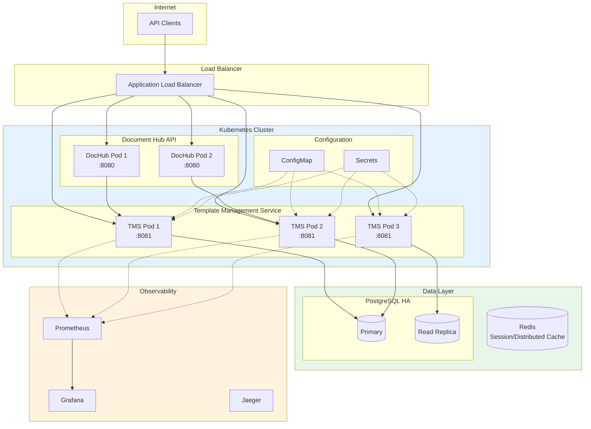
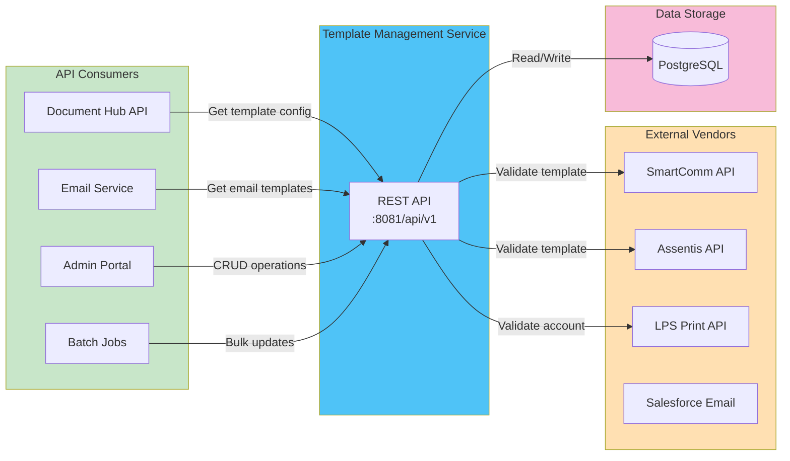
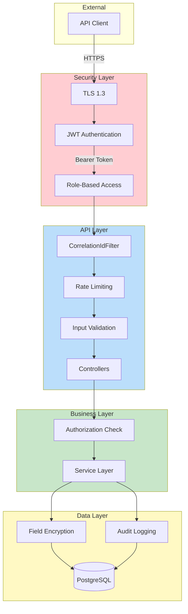

# Template Management Service - Architecture Diagrams

## Overview

This document provides comprehensive architecture diagrams for the Template Management Service, showing its internal structure, external integrations, and data flows.

---

## 1. High-Level System Context

Shows how Template Management Service fits within the broader Document Hub ecosystem.



---

## 2. Service Architecture (Layered)

Shows the internal layered architecture of the Template Management Service.



---

## 3. Component Diagram

Detailed view of components and their responsibilities.



---

## 4. Data Flow - Template Creation



---

## 5. Data Flow - Vendor Routing (Failover)



---

## 6. Database Schema

```mermaid
erDiagram
    master_template_definition {
        uuid master_template_id PK
        int template_version PK
        string template_type
        string line_of_business
        string display_name
        string template_name
        string template_description
        string template_category
        string language_code
        string owning_dept
        boolean notification_needed
        boolean regulatory_flag
        boolean message_center_doc_flag
        boolean active_flag
        boolean shared_document_flag
        string sharing_scope
        string communication_type
        string workflow
        boolean single_document_flag
        json template_variables
        json data_extraction_config
        json eligibility_criteria
        json access_control
        json required_fields
        json template_config
        bigint start_date
        bigint end_date
        string created_by
        timestamp created_timestamp
        string updated_by
        timestamp updated_timestamp
        boolean archive_indicator
        timestamp archive_timestamp
        string record_status
    }

    template_vendor_mapping {
        uuid template_vendor_id PK
        uuid master_template_id FK
        int template_version FK
        string vendor
        string vendor_type
        string vendor_template_key
        string vendor_template_name
        int vendor_mapping_version
        int priority_order
        boolean primary_flag
        boolean active_flag
        string vendor_status
        string template_status
        json vendor_config
        json api_config
        json schema_info
        json template_fields
        int rate_limit_per_minute
        int rate_limit_per_day
        int timeout_ms
        int max_retry_attempts
        decimal cost_per_unit
        string cost_unit
        string[] supported_regions
        string[] supported_formats
        string health_check_endpoint
        timestamp last_health_check
        string last_health_status
        bigint start_date
        bigint end_date
        string created_by
        timestamp created_timestamp
        boolean archive_indicator
        string record_status
    }

    master_template_definition ||--o{ template_vendor_mapping : "has vendors"
```



---

## 7. Caching Strategy

```mermaid
flowchart TB
    subgraph Request["Incoming Request"]
        R1[GET /templates/{id}/versions/{v}]
    end

    subgraph CacheLayer["Caffeine Cache Layer"]
        direction TB
        TC["Template Cache<br/>─────────<br/>Key: {templateId}:{version}<br/>TTL: 30 minutes<br/>Max: 1000 entries"]
        VC["Vendor Cache<br/>─────────<br/>Key: {vendorId}<br/>TTL: 30 minutes<br/>Max: 500 entries"]
    end

    subgraph Logic["Cache Logic"]
        Check{Cache Hit?}
        Return[Return Cached]
        Query[Query Database]
        Store[Store in Cache]
    end

    subgraph DB["PostgreSQL"]
        Data[(Template Data)]
    end

    R1 --> Check
    Check -->|Yes| Return
    Check -->|No| Query
    Query --> Data
    Data --> Store
    Store --> TC
    Store --> Return

    subgraph Invalidation["Cache Invalidation Triggers"]
        I1[Template Update]
        I2[Template Delete]
        I3[Vendor Status Change]
    end

    I1 --> TC
    I2 --> TC
    I3 --> VC

    style CacheLayer fill:#ffcc80
    style TC fill:#ff8a65
    style VC fill:#ff8a65
```

---

## 8. Deployment Architecture



---

## 9. Integration Points



---

## 10. Security Architecture



---

## View These Diagrams

1. **GitHub/GitLab**: Mermaid diagrams render automatically
2. **VS Code**: Install "Markdown Preview Mermaid Support" extension
3. **Online**: Use [Mermaid Live Editor](https://mermaid.live)

---

## Summary

| Diagram | Purpose |
|---------|---------|
| System Context | Shows external systems and actors |
| Service Architecture | Internal layered structure |
| Component Diagram | Detailed component responsibilities |
| Template Creation Flow | Step-by-step data flow |
| Vendor Routing Flow | Failover mechanism |
| Database Schema | Entity relationships |
| Caching Strategy | Cache architecture and invalidation |
| Deployment Architecture | Production deployment view |
| Integration Points | All external connections |
| Security Architecture | Security controls and layers |
